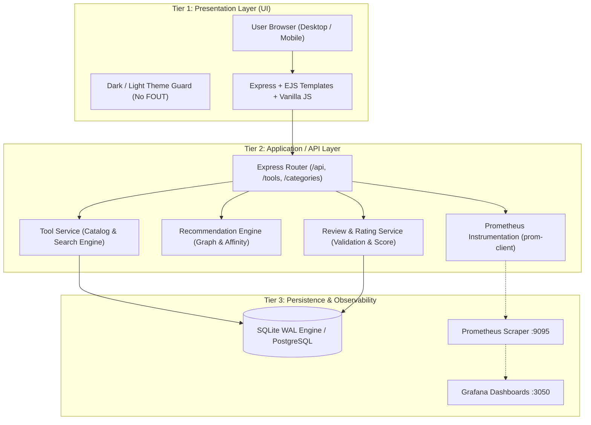

# DevOps & Cloud Native Tools Hub

[](LICENSE)
[](package.json)
[](#-architecture-overview)
[](#-observability--telemetry)

The definitive open-source web application and educational hub dedicated to the world's most battle-tested open-source tools for **Cloud Computing**, **DevOps**, and **Platform Engineering**.

Explore in-depth architectural guides, understand why engineering teams adopt each tool, test quick-start commands, discover companion stack recommendations, and read real-world practitioner reviews and ratings.

---

## Table of Contents

- [1. Architecture Overview](#1-architecture-overview)
- [2. Featured Open Source Tools](#2-featured-open-source-tools)
- [3. Key Platform Features](#3-key-platform-features)
- [4. Quick Start & Local Development](#4-quick-start--local-development)
  - [4.1 Running with Node.js (Instant Local Run)](#41-running-with-nodejs-instant-local-run)
  - [4.2 Running with Docker Compose](#42-running-with-docker-compose)
- [5. REST API Reference](#5-rest-api-reference)
- [6. Observability & Telemetry](#6-observability--telemetry)
- [7. How to Add New Tools](#7-how-to-add-new-tools)
- [8. License](#8-license)

---

## 1. Architecture Overview

DevOps Tools Hub is built upon a clean, unified **3-tier cloud application architecture** designed for high throughput, zero external setup friction, and production readiness:



| Tier | Component | Technology | Role |
| :--- | :--- | :--- | :--- |
| **Tier 1: Presentation** | Responsive Web UI | Express, EJS, Modern CSS, Vanilla JS | Delivers responsive catalog cards, real-time live search, interactive star rating picker, instant upvoting, and clean Dark/Light theme switching. |
| **Tier 2: Logic / API** | REST API & Services | Node.js 22, Express | Houses business logic: algorithmic tool recommendations, full-text catalog queries, reviews aggregation, and health checks. |
| **Tier 3: Persistence** | Database & Storage | SQLite 3 (WAL mode) / PostgreSQL | Stores tool specifications, tags, categories, community reviews, ratings, and helpful upvotes with zero external dependencies required out of the box. |
| **Telemetry** | Metrics & Dashboards | `prom-client`, Prometheus, Grafana | Records latency histograms and request counters at `/metrics`, visualized in Grafana. |

---

## 2. Featured Open Source Tools

The catalog comes pre-seeded with **26 premier open-source tools** across 9 foundational cloud domains:

| Category | Tools Included |
| :--- | :--- |
| **Container & Orchestration** | [Kubernetes](http://localhost:4000/tools/kubernetes), [Helm](http://localhost:4000/tools/helm), [KEDA](http://localhost:4000/tools/keda) |
| **Containerization** | [Docker](http://localhost:4000/tools/docker), [Podman](http://localhost:4000/tools/podman) |
| **Infrastructure as Code (IaC)** | [OpenTofu / Terraform](http://localhost:4000/tools/opentofu), [Pulumi](http://localhost:4000/tools/pulumi) |
| **Configuration Management** | [Ansible](http://localhost:4000/tools/ansible) |
| **CI/CD & GitOps** | [Argo CD](http://localhost:4000/tools/argocd), [Flux CD](http://localhost:4000/tools/flux), [Jenkins](http://localhost:4000/tools/jenkins) |
| **Observability & Monitoring** | [Prometheus](http://localhost:4000/tools/prometheus), [Grafana](http://localhost:4000/tools/grafana), [OpenTelemetry](http://localhost:4000/tools/opentelemetry), [Jaeger](http://localhost:4000/tools/jaeger), [Loki](http://localhost:4000/tools/loki) |
| **Networking & Service Mesh** | [Cilium](http://localhost:4000/tools/cilium), [Istio](http://localhost:4000/tools/istio), [Envoy](http://localhost:4000/tools/envoy) |
| **Security & Secrets** | [HashiCorp Vault](http://localhost:4000/tools/vault), [Trivy](http://localhost:4000/tools/trivy), [Falco](http://localhost:4000/tools/falco), [Cert-Manager](http://localhost:4000/tools/cert-manager) |
| **Platform Engineering & IDP** | [Backstage](http://localhost:4000/tools/backstage), [Crossplane](http://localhost:4000/tools/crossplane), [K9s](http://localhost:4000/tools/k9s) |

---

## 3. Key Platform Features

- 🔍 **Real-Time Client-Side Search**: Instant live filtering across tool titles, categories, tags, and taglines as you type.
- 💡 **Deep Architectural Explanations**: Every tool includes detailed writeups on *What it does*, *Why it's used*, *Architecture & how it works under the hood*, and *When to pick it*.
- ⚡ **Interactive Terminal Quickstart**: One-click copy buttons for terminal installation and sample run commands.
- ⭐ **Community Field Reports & Reviews**: Real-world reviews from engineers sharing *What they liked*, *Gotchas to watch out for*, and *Experience level* (Daily Driver, Production, PoC).
- 🤖 **Intelligent Recommendation Engine**: Dynamically suggests stack companions based on category affinity, shared ecosystem tags, and real-world pairing synergies (e.g. viewing Kubernetes recommends Helm, Argo CD, Cilium, and K9s).
- 🌓 **Zero-FOUT Dark / Light Mode**: Seamless theme switcher persisted via `localStorage` with an inline head guard script preventing screen flicker.
- 📊 **Prometheus Metrics**: Built-in HTTP request duration histogram and route counters exposed at `/metrics`.

---

## 4. Quick Start & Local Development

### 4.1 Running with Node.js (Instant Local Run)

```bash
# 1. Clone repository and navigate to directory
cd devops-tools-hub

# 2. Install dependencies (Node 20+ required)
npm install

# 3. Start application
npm start
```

Open your browser at **[http://localhost:4000](http://localhost:4000)**. The database will automatically initialize and seed itself on first startup!

### 4.2 Running with Docker Compose

To run the application alongside Prometheus and Grafana:

```bash
# Build and start all services in detached mode
docker compose up --build -d

# Check status of containers
docker compose ps
```

Access services:
- **DevOps Tools Hub**: [http://localhost:4000](http://localhost:4000)
- **Prometheus Telemetry**: [http://localhost:9095](http://localhost:9095)
- **Grafana Dashboards**: [http://localhost:3050](http://localhost:3050)

To stop the stack:
```bash
docker compose down
```

---

## 5. REST API Reference

The platform provides a complete JSON REST API:

| Method | Endpoint | Description |
| :--- | :--- | :--- |
| `GET` | `/api/tools` | Query all tools. Supports `?category=...`, `?search=...`, `?sort=name-asc`. |
| `GET` | `/api/tools/:id` | Get full technical specifications and review summary for a tool. |
| `GET` | `/api/tools/:id/recommendations` | Get top recommended companion tools. |
| `GET` | `/api/tools/:id/reviews` | Get all practitioner reviews for a tool. |
| `POST` | `/api/tools/:id/reviews` | Submit a new review (`author`, `role`, `rating`, `comment`, `whatLiked`, `gotchas`). |
| `POST` | `/api/reviews/:id/vote` | Upvote a helpful review. |
| `GET` | `/api/categories` | List all categories with tool counts. |
| `GET` | `/api/stats` | Platform summary counts (tools, reviews, avg rating). |
| `GET` | `/health` | Liveness health check. |
| `GET` | `/metrics` | Prometheus metrics scrape endpoint. |

### Sample Request: Submit Review via API

```bash
curl -X POST http://localhost:4000/api/tools/kubernetes/reviews \
  -H "Content-Type: application/json" \
  -d '{
    "author": "sre_pat",
    "role": "Lead Infrastructure Engineer",
    "experience": "Daily Production Driver",
    "rating": 5,
    "whatLiked": "Declarative desired-state reconciliation",
    "gotchas": "Initial networking complexity",
    "comment": "Crucial for running our 50+ microservices reliably across multi-cloud regions."
  }'
```

---

## 6. Observability & Telemetry

DevOps Tools Hub includes native Prometheus telemetry:
- Scrape endpoint: `http://localhost:4000/metrics`
- Key metrics:
  - `http_request_duration_seconds`: Histogram of HTTP latency segmented by method, route, and status code.
  - Standard Node.js process metrics (event loop lag, memory RSS, heap utilization, CPU usage).

---

## 7. How to Add New Tools

To add a new open-source tool to the catalog:
1. Open [`src/db/seed-data.js`](file:///home/mkbntech/Documents/pr-env/devops-tools-hub/src/db/seed-data.js).
2. Add an entry to the `TOOLS` array with:
   - `id`: unique slug
   - `name`: tool name
   - `tagline`: punchy one-liner
   - `category`: domain classification
   - `whatItDoes`, `whyItsUsed`, `architecture`, `quickstart`
3. Add a corresponding vector logo in `public/img/icons/<id>.svg`.
4. Delete `data/devops-tools.db` to re-seed or run the migration script.

---

## 8. License

Distributed under the MIT License. Built for the global developer, SRE, and platform engineering community.
